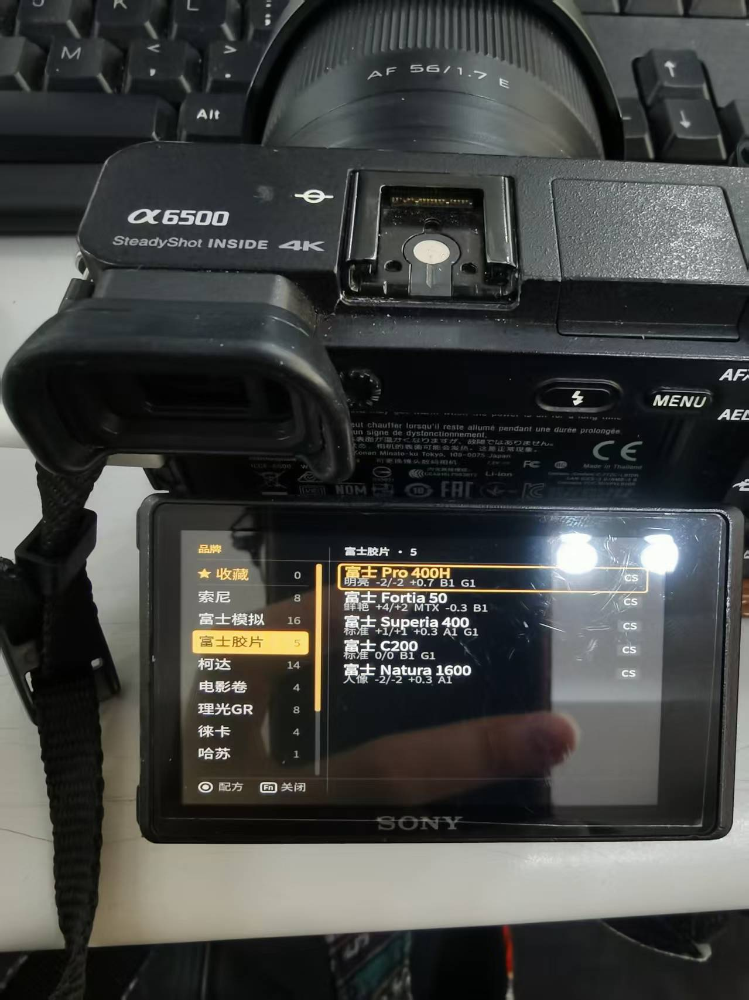
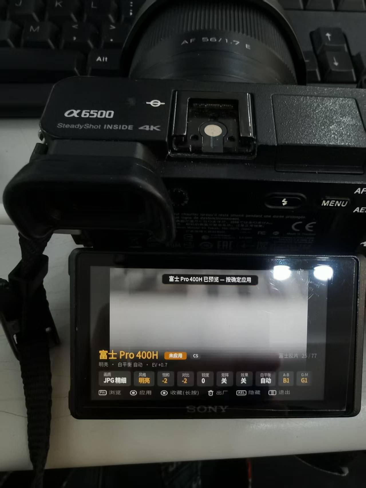
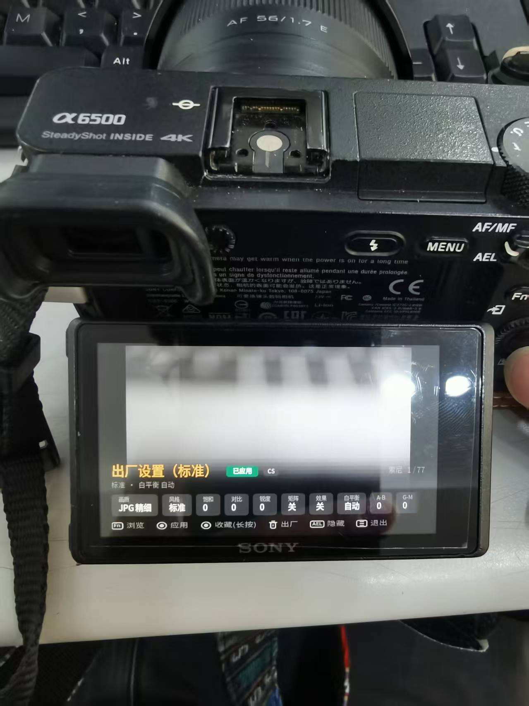

<h1 align="center">胶片坊 RecipeLab 中文汉化版</h1>

索尼相机机内胶片配方应用 <b>Recipe Lab</b> 的简体中文汉化衍生版 
77 种胶片色彩配方，实时预览并写入相机，在所有拍摄模式长期生效

<a href="https://github.com/voxivoid/recipe-lab-sony-pmca">上游原版项目</a>
·
<a href="https://github.com/voxivoid/recipe-lab-sony-pmca/releases">原版 Releases</a>

---

## 这是什么

**Recipe Lab（胶片坊）** 是一个运行在索尼相机本机的小型应用，内置 77 种色彩配方，可模拟其他相机与经典胶卷的色彩风格：富士胶片模拟、理光 GR 影像控制、徕卡、哈苏、佳能、尼康色彩，以及柯达、富士、CineStill、伊尔福等经典胶卷。

拨动拨轮，实时画面随之变化，按确定键写入相机；此后无论照片还是视频、任何拍摄模式，相机都会以该风格成像。关闭应用、关机重启后依然生效。

本仓库是 [voxivoid/recipe-lab-sony-pmca](https://github.com/voxivoid/recipe-lab-sony-pmca) 的简体中文汉化衍生版，界面全部中文化，并修复了相机固件字体缺字导致部分汉字显示为方框的问题。在A6500上验证OK无异常，可正常写入使用。

## 实机截图（索尼 A6500）

| 配方列表 | 配方详情（未应用） | 配方详情（已应用） |
|:---:|:---:|:---:|
|  |  |  |

- 左侧按品牌分组：收藏 / 索尼 / 富士模拟 / 富士胶片 / 柯达 / 电影卷 / 理光GR / 徕卡 / 哈苏
- 橙色「未应用」= 当前配方尚未写入相机；绿色「已应用」= 配方已写入并生效
- 参数明细：画质 / 风格 / 饱和 / 对比 / 锐度 / 矩阵 / 效果 / 白平衡 / A-B / G-M

## 功能与配方

应用内配方按品牌分组：索尼、富士模拟、富士胶卷、柯达、电影卷、理光 GR、徕卡、哈苏、佳能/尼康、松下/奥巴、其他胶卷、伊尔福等，共 77 种。

- **CS 配方**：基于创意风格（Creative Style），可调整风格、饱和度、对比度、锐度与色彩矩阵
- **PE 配方**：基于照片效果（Picture Effect），仅在 JPEG 画质下生效
- 画质、白平衡、曝光补偿、DRO 等参数均可在应用内查看与调整
- 长按确定键可将配方加入收藏

完整配方说明见上游项目文档。

## 兼容性（适用机型）

应用本身不做机型限制，凡支持 **PlayMemories Camera Apps** 的索尼机型理论上均可安装。

### 已确认可运行（✅）

| 机型 | 型号代码 | 备注 |
|---|---|---|
| **A6000** | ILCE-6000 | 上游主力开发测试机型 |
| **A6500** | ILCE-6500 | 本汉化版实机验证，安装/写入/重启均正常 |
| **A6300** | ILCE-6300 | 已确认可写入并在重启后保持 |
| **A5100** | ILCE-5100 | 可运行；无 Fn/AEL 按键，品牌列表与面板切换不可达 |
| **A7** | ILCE-7 | 已确认可写入并在重启后保持 |
| **A7 II** | ILCE-7M2 | 已确认可运行 |
| **A7R** | ILCE-7R | 已确认可写入并在重启后保持 |
| **A7R II** | ILCE-7RM2 | 已确认可写入并在重启后保持 |
| **RX100 V** | DSC-RX100M5 | 唯一已确认的黑卡机型 |
| **NEX-5T** | NEX-5T | 最老一代支持应用的机型 |

### 理论支持但未实测（❔）

A5000、A7S、A7S II、NEX-5R、NEX-6、A68、A77 II、A99 II、RX100 III、RX100 IV、RX1R II、RX10 II、RX10 III、HX60、HX90、HX400、WX500 等。

### 不支持（❌）

2016 年底之后发布的机型固件已签名，无法安装任何 PlayMemories 应用：A6100、A6400、A6600、A6700、A7 III、A7R III、A7R IV、A7S III、A7C、A7C II、A7CR、A9、A1、ZV-E10、FX30、FX3 等。

> 判断方法：相机菜单中有 `MENU → 应用程序` 列表，即支持安装。

## 一键自动安装（Windows，推荐）

本仓库附带一键安装脚本，免去手动配置的麻烦，自动完成：下载安装工具 → 获取最新汉化 APK → 检测相机 → 安装到相机。

**方式一：下载便携包（最简单，含工具与 APK，离线可用）**
1. 前往本仓库 [Releases](../../releases) 页面，下载 **`RecipeLab-CN-Portable-Installer.zip`**（胶片坊一键安装便携包）
2. 解压到任意位置（U 盘、电脑桌面均可）
3. 相机开机，USB 连接模式设为 **MTP**，用数据线连接电脑
4. 双击 **`install_camera.bat`** → 弹出管理员授权时点**「是」** → 自动安装完成

**方式二：使用仓库内脚本（联网自动下载工具与 APK）**
1. 进入 [`auto-install/`](auto-install/) 目录
2. 相机开机，USB 连接模式设为 **MTP**，连接电脑
3. 双击 **`install_camera.bat`**，同样按提示授予管理员权限即可

> 脚本需要**管理员权限**（通过 WPD 驱动访问相机 USB），双击后请在弹出的授权窗口点「是」。

## 手动安装方法

需要：相机、USB 数据线、存储卡、一台电脑（Windows / macOS / Linux）。

1. **下载安装工具 Sony-PMCA-RE**（作者 ma1co）：前往
   [Sony-PMCA-RE Releases](https://github.com/ma1co/Sony-PMCA-RE/releases)，
   Windows 用户下载 `pmca-gui.exe`，无需安装，直接运行。
2. **下载本应用 APK**：在本仓库的 [Releases](../../releases) 页面下载最新 APK 文件。
3. **设置相机**：开机，菜单中进入 `设置 → USB连接`，选择 **MTP**（注意：不是"海量存储器"），用 micro USB 线连接电脑。
4. **安装**：运行 `pmca-gui.exe` → 选择 **Install app from file** → 选中下载的 APK → 等待完成。
5. 安装结束后拔线，关机再开机。应用位于 `MENU → 应用程序 → 应用程序列表`。

## 使用简介

| 按键 | 功能 |
|---|---|
| 拨轮 / 左右方向键 | 切换配方，实时画面立即变化 |
| Fn | 打开目录（左侧品牌、右侧lut） |
| 确定键（中央） | 应用当前配方并写入相机 |
| 长按确定键 | 收藏 / 取消收藏配方 |
| 上下方向键 | 在lut行与参数行之间切换 |
| AEL | 循环切换面板显示（完整面板 → 小标签 → 隐藏） |
| 删除键 | 载入出厂值 |
| MENU | 退出应用 |

应用配方后请**关机再开机**，风格即在所有模式下成为默认设置。

## 注意事项（安装前必读）

1. **签名不同，无法覆盖安装**：本汉化版签名与原版 / 其他汉化版不同，不能直接覆盖升级。安装前需先在相机上卸载旧版本，再全新安装。
2. **卸载会清除数据**：卸载应用会同时清除收藏列表与应用内配置，请先记录需要保留的内容。
3. **PE 配方需要 JPEG**：使用照片效果类配方时，画质必须为 JPEG；设为 RAW 或 RAW+JPEG 时相机会自动停用效果。
4. **部分配方超出菜单范围**：个别配方的饱和度超出菜单滑块的常规范围（±3），若手动触碰该滑块会回弹到常规范围，重新在应用内选择配方即可恢复。
5. **预览为临时效果**：应用内的实时预览在关闭应用后消失，只有按确定键写入的设置会保留。
6. 本汉化版已内置精简中文字体，不依赖相机固件字体；如界面仍出现方框，请确认安装的是本仓库最新 Release。

## 更新日志

- **v1.3.1-cn.1（当前）**：同步上游 v1.3.1 全部代码（逐槽位只读检查、写入前锁定检测）；保留本汉化版特有修复（读取容错、退出恢复相机原始参数、中文字体、面板缩小）。**新增一键自动安装脚本**（`auto-install/`），附完整便携安装包，Windows 双击即可安装到相机。
- **v1.3.5（历史）**：修复与「胶片工坊」等其它机内应用同时安装时的冲突——退出时恢复相机进入前的原始参数，不将实时预览参数残留给其它应用。
- **v1.3.4（历史）**：修正"已应用"提示文案：重启相机后照片/视频/菜单全部一致生效。
- **v1.3.3（历史）**：读取配方容错，单槽位读取失败不再中断整个加载。
- **v1.3.2（历史）**：字体精确子集（仅收录应用实际用字，APK 体积大幅缩小）、面板缩小。
- **v1.3.1（历史）**：内置精简中文字体，修复「徕」等汉字显示为方框的问题。
- **v1.3.0（历史）**：初始汉化版。

> 版本命名规则：`上游版本号 + 汉化修订号`（如 `1.3.0-cn.1`）。cn.x 为本汉化版的修订序号，不代表上游已有更高版本。

## 与上游版本的差异

- 界面全部简体中文化，照片效果等术语对齐索尼官方简体中文命名
- 内置精简中文字体（基于思源黑体 Noto Sans CJK SC，OFL 协议，仅收录应用实际用字），修复「徕」等汉字在相机固件字体下显示为方框的问题
- 收紧面板字体度量，底部信息面板占用面积与原版一致
- 未改动任何配方参数与核心功能逻辑

## 致谢

- 原应用作者：[voxivoid](https://github.com/voxivoid)，配方、逆向与应用本体
- PlayMemories 平台逆向：[ma1co](https://github.com/ma1co) 及 [Sony-PMCA-RE](https://github.com/ma1co/Sony-PMCA-RE)
- 内置字体：[Noto Sans CJK](https://fonts.google.com/noto/specimen/Noto+Sans+CJK)（SIL Open Font License 1.1）

## 许可证

本衍生版沿用上游 MIT 许可证。Recipe Lab 原项目 © voxivoid。
